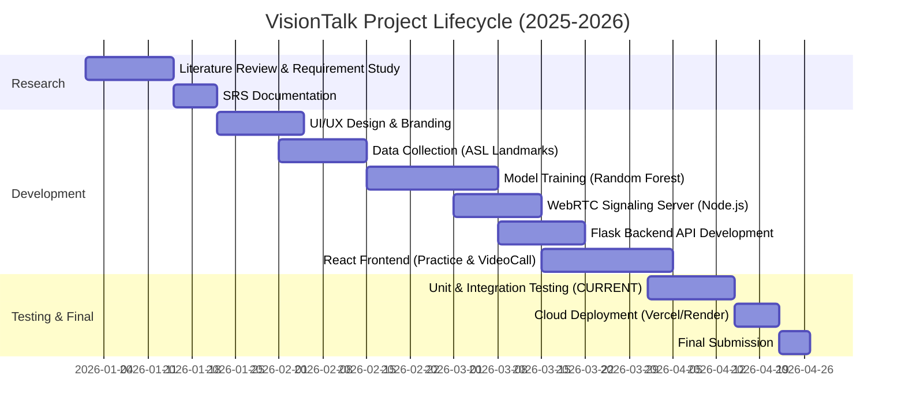
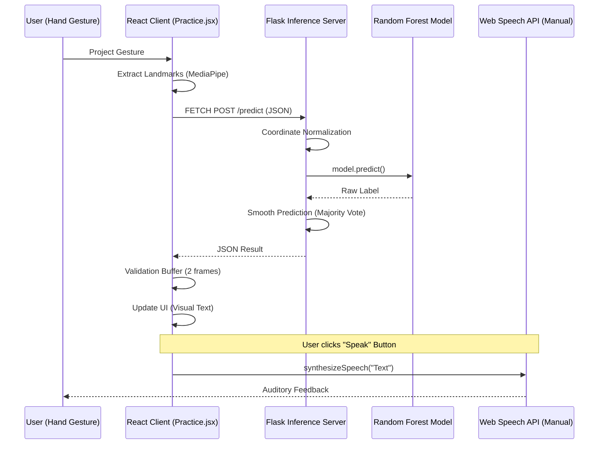
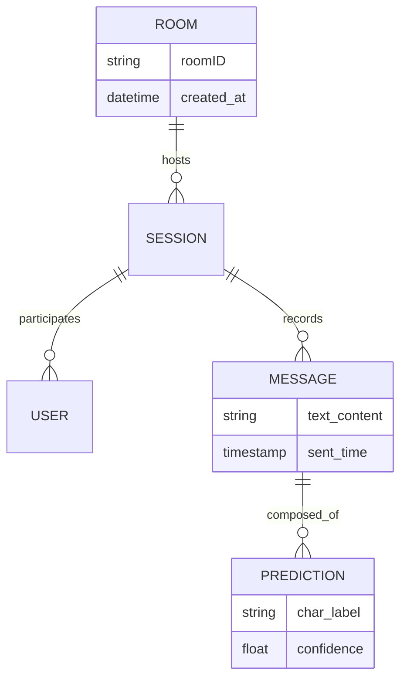
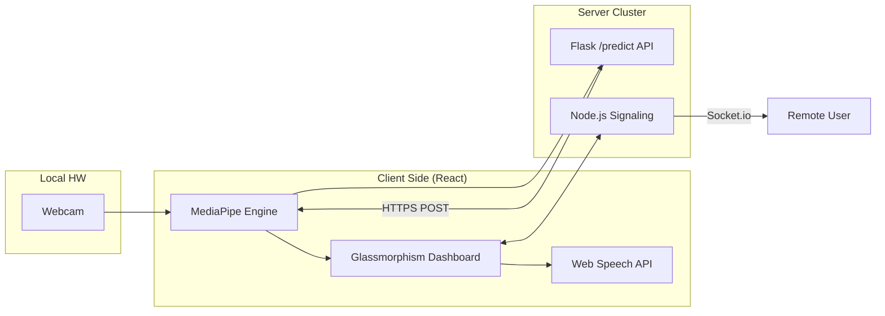
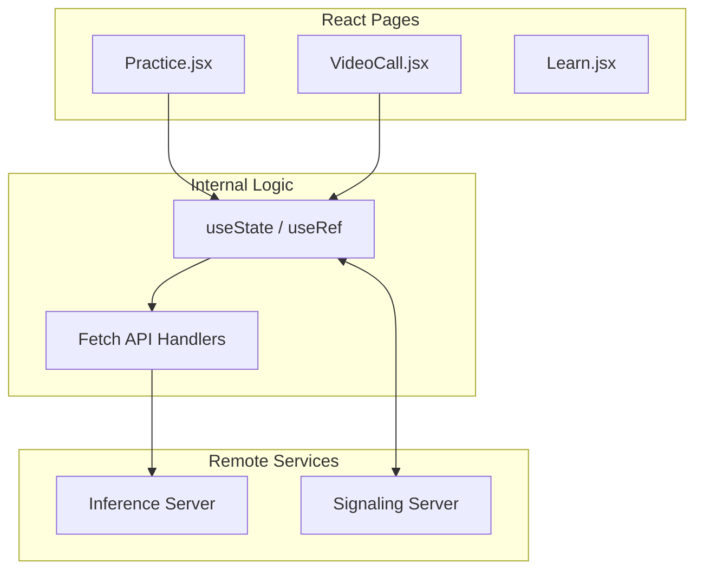
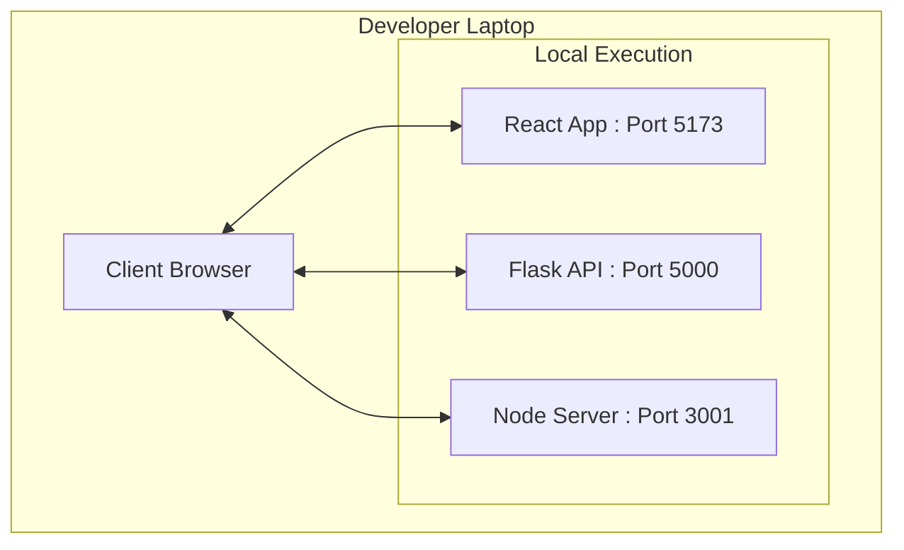

# VISIONTALK: AI-POWERED ASSISTIVE SYSTEM FOR THE DEAF AND HEARING IMPAIRED

---
# 🔴 SECTION 1: COVER PAGE
---

<center>

**A PROJECT REPORT ON**

# VISIONTALK

**AI-POWERED ASSISTIVE SYSTEM FOR THE DEAF AND HEARING IMPAIRED**

**SUBMITTED FOR THE PARTIAL FULFILLMENT OF THE DEGREE OF**

**BACHELOR OF TECHNOLOGY**
**(INFORMATION TECHNOLOGY)**

**SUBMITTED BY**

**[CANDIDATE NAME] ([ID NO])**

**UNDER THE GUIDANCE OF**

**[GUIDE NAME]**
**(Designation)**


**DEPARTMENT OF INFORMATION TECHNOLOGY**
**FACULTY OF TECHNOLOGY**
**DHARMSINH DESAI UNIVERSITY**
**NADIAD – 387 001**

**APRIL – 2026**

</center>

---
# 🔴 SECTION 1: FIRST PAGE
---

<center>

**A PROJECT REPORT ON**

# VISIONTALK

**AI-POWERED ASSISTIVE SYSTEM FOR THE DEAF AND HEARING IMPAIRED**

**SUBMITTED BY**

**[CANDIDATE NAME] ([ID NO])**

**GUIDED BY**

**[GUIDE NAME]**
**(Designation)**


**DEPARTMENT OF INFORMATION TECHNOLOGY**
**FACULTY OF TECHNOLOGY**
**DHARMSINH DESAI UNIVERSITY**
**NADIAD – 387 001**

**APRIL – 2026**

</center>

---
# 🔴 SECTION 1: CANDIDATE’S DECLARATION
---

**CANDIDATE’S DECLARATION**

I hereby declare that the work presented in this project report entitled **"VisionTalk: AI-Powered Assistive System for the Deaf and Hearing Impaired"** is a result of my own contribution and has not been submitted elsewhere for any other degree or diploma. All the sources of information used in this project have been duly acknowledged.

\
\
\
**Date:** [Date] \
**Place:** Nadiad \
\
\
\
**[CANDIDATE NAME]** \
**[ID NO]**

---
# 🔴 SECTION 1: COLLEGE CERTIFICATE
---

<center>

**DEPARTMENT OF INFORMATION TECHNOLOGY**
**FACULTY OF TECHNOLOGY**
**DHARMSINH DESAI UNIVERSITY, NADIAD**

# CERTIFICATE

</center>

This is to certify that the project report entitled **"VisionTalk: AI-Powered Assistive System for the Deaf and Hearing Impaired"** has been successfully completed by **[CANDIDATE NAME] ([ID NO])** in partial fulfillment of the requirements for the degree of **Bachelor of Technology in Information Technology** during the 6th Semester for the academic year 2025-2026.

\
\
\
\
**[GUIDE NAME]** \
**Internal Guide** \
**IT Department, DDU**

\
\
\
\
**Prof. (Dr.) [HOD NAME]** \
**Head of Department** \
**IT Department, DDU**

---
# 🔴 SECTION 1: ACKNOWLEDGEMENT
---

**ACKNOWLEDGEMENT**

I would like to express my sincere gratitude to my project guide, **[GUIDE NAME]**, for their constant support, encouragement, and invaluable guidance throughout the course of this project. Their insights were instrumental in shaping the technical architecture of **VisionTalk**.

Special thanks to the open-source community for providing tools like MediaPipe and Flask, which allowed for real-time accessible communication solutions.

Finally, I would like to thank my parents and friends for their constant motivation and support during the development and documentation phases of this project.

\
\
\
**[CANDIDATE NAME]**

---
# 🔴 SECTION 1: TABLE OF CONTENTS
---

**TABLE OF CONTENTS**

| No. | Title | Page No. |
| :--- | :--- | :--- |
| | **Abstract** | **i** |
| | **List of Figures** | **ii** |
| | **List of Tables** | **iii** |
| | **Abbreviations** | **iv** |
| | **Notations** | **v** |
| **1** | **CHAPTER 1: INTRODUCTION** | **1** |
| | 1.1 Background | 1 |
| | 1.2 Problem Definition | 2 |
| | 1.3 Purpose | 2 |
| | 1.4 Scope | 3 |
| | 1.5 Objectives | 3 |
| | 1.6 Literature Review | 4 |
| **2** | **CHAPTER 2: PROJECT MANAGEMENT** | **6** |
| | 2.1 Feasibility Study | 6 |
| | 2.2 Project Planning | 8 |
| | 2.3 Development Model | 9 |
| | 2.4 Milestones | 10 |
| | 2.5 Roles & Responsibilities | 11 |
| | 2.6 Gantt Chart | 12 |
| **3** | **CHAPTER 3: SYSTEM REQUIREMENTS STUDY** | **13** |
| | 3.1 Existing System Analysis | 13 |
| | 3.2 Weaknesses of Current Systems | 14 |
| | 3.3 User Characteristics | 14 |
| | 3.4 Hardware Requirements | 15 |
| | 3.5 Software Requirements | 15 |
| | 3.6 Constraints | 16 |
| | 3.7 Assumptions | 17 |
| **4** | **CHAPTER 4: SYSTEM ANALYSIS (SRS)** | **18** |
| | 4.1 Functional Requirements | 18 |
| | 4.2 Non-Functional Requirements | 19 |
| | 4.3 Use Case Diagram | 20 |
| | 4.4 Sequence Diagram | 21 |
| | 4.5 Class Diagram | 22 |
| | 4.6 ER Diagram | 23 |
| | 4.7 Data Dictionary | 24 |
| **5** | **CHAPTER 5: SYSTEM DESIGN** | **26** |
| | 5.1 Architecture Design | 26 |
| | 5.2 MVC Explanation | 27 |
| | 5.3 Component Diagram | 28 |
| | 5.4 Deployment Diagram | 29 |
| | 5.5 Database Design | 30 |
| | 5.6 UI Design | 31 |
| **6** | **CHAPTER 6: IMPLEMENTATION** | **33** |
| | 6.1 Technology Stack | 33 |
| | 6.2 Module-wise Explanation | 34 |
| | 6.3 Internal Working Logic | 36 |
| **7** | **CHAPTER 7: TESTING** | **38** |
| | 7.1 Testing Strategy | 38 |
| | 7.2 Testing Methods | 39 |
| | 7.3 Test Cases | 40 |
| **8** | **CHAPTER 8: USER MANUAL** | **42** |
| | 8.1 Usage Instructions | 42 |
| | 8.2 Interface Explanation | 43 |
| **9** | **CHAPTER 9: LIMITATIONS & FUTURE ENHANCEMENTS** | **45** |
| | 9.1 Realistic System Limitations | 45 |
| | 9.2 Future Enhancements | 46 |
| **10** | **CHAPTER 10: CONCLUSION & DISCUSSION** | **48** |
| | 10.1 Summary | 48 |
| | 10.2 Learning Outcomes | 49 |
| | 10.3 Challenges Faced | 50 |
| | **Appendices** | **51** |
| | **References** | **52** |
| | **Experience** | **54** |

---
# 🔴 SECTION 1: ABSTRACT (ROMAN: i)
---

**ABSTRACT**

VisionTalk is an AI-powered real-time platform designed to bridge the communication gap between the deaf and hearing communities. The system leverages state-of-the-art computer vision to translate American Sign Language (ASL) into text and high-fidelity speech. By utilizing a lightweight Random Forest model trained on 21 hand landmarks provided by Google MediaPipe, the architecture achieves low-latency inference suitable for real-time video calls. The platform integrates a WebRTC signaling server for peer-to-peer communication, ensuring that users can interact seamlessly across different machines. VisionTalk features a premium glassmorphism dashboard, threshold-based majority-vote smoothing, and a localized sentence assembly mechanism, making it a robust assistive solution for modern accessibility needs.

---
# 🔴 SECTION 1: LIST OF FIGURES (ROMAN: ii)
---

**LIST OF FIGURES**

| Fig No. | Title | Page No. |
| :--- | :--- | :--- |
| 2.1 | Gantt Chart: Project Lifecycle & Sprints | 12 |
| 4.1 | Use Case Diagram: Deaf/Hearing Impaired Interaction | 20 |
| 4.2 | Sequence Diagram: Local AI Inference & TTS Pipeline | 21 |
| 4.3 | Analysis Class Diagram: System Architecture | 22 |
| 4.4 | Entity Relationship Diagram: Data Model | 23 |
| 5.1 | System Architecture Pipeline: AI & WebRTC Flow | 26 |
| 5.2 | Component Interaction Diagram: Modular UI Design | 28 |
| 5.3 | Deployment Diagram: Development Environment | 29 |
| 5.4 | Dashboard UI Mockup: Practice & Video Call | 31 |
| 6.1 | Hand Landmark Mapping: MediaPipe Keys | 36 |

---
# 🔴 SECTION 1: LIST OF TABLES (ROMAN: iii)
---

**LIST OF TABLES**

| Table No. | Title | Page No. |
| :--- | :--- | :--- |
| 3.1 | Hardware Specifications | 15 |
| 3.2 | Software Specifications | 16 |
| 4.1 | Data Dictionary for Prediction JSON | 24 |
| 7.1 | Unit and Integration Test Case Scenarios | 40 |

---
# 🔴 SECTION 1: ABBREVIATIONS (ROMAN: iv)
---

**ABBREVIATIONS**

*   **ASL:** American Sign Language
*   **AI:** Artificial Intelligence
*   **CV:** Computer Vision
*   **TTS:** Text-to-Speech
*   **WebRTC:** Web Real-Time Communication
*   **SRS:** System Requirements Specification
*   **MVC:** Model View Controller
*   **API:** Application Programming Interface
*   **CORS:** Cross-Origin Resource Sharing

---
# 🔴 SECTION 1: NOTATIONS (ROMAN: v)
---

**NOTATIONS**

*   **$L \in \mathbb{R}^{21 \times 2}$:** Set of 2D hand landmark coordinates.
*   **$V_{vote}$:** Majority vote mechanism for prediction smoothing.
*   **$t_{threshold}$:** Temporal threshold for character stabilization (2 frames).
*   **$P(C|L)$:** Probability of class $C$ given landmark vector $L$.

---
# 🔴 CHAPTER 1: INTRODUCTION
---

### 1.1 BACKGROUND
Verbal communication is a foundational human skill, yet it remains a significant barrier for the deaf and hearing-impaired community. Traditional methods like sign language interpreters are not always available or affordable. VisionTalk addresses this by acting as a digital interpreter, converting visual sign language into audible and textual formats, thus enabling a smoother interaction between signers and non-signers.

### 1.2 PROBLEM DEFINITION
The hearing community often lacks understanding of ASL, leading to the isolation of deaf individuals in professional and public environments. Current automated systems are either slow, require specialized hardware (like flex-sensor gloves), or fail to handle the jittery nature of real-time video capture. VisionTalk provides a software-only, computer vision-based bridge that is both accessible and responsive.

### 1.3 PURPOSE
The primary purpose is to provide a real-time ASL translation platform that works through a standard webcam. It aims to empower deaf users to communicate their thoughts during video conferences or practice sessions independently.

### 1.4 SCOPE
The project covers static ASL alphabet recognition and word assembly. It includes a dashboard for self-practice and a peer-to-peer video conferencing module using WebRTC. It does not currently handle dynamic whole-word signs or ISL (Indian Sign Language).

### 1.5 OBJECTIVES
*   Achieve >90% accuracy on static ASL landmarks.
*   Maintain a 60 FPS frontend tracking rate using MediaPipe.
*   Implement server-side majority voting for flicker-free predictions.
*   Facilitate P2P communication between two remote clients.

### 1.6 LITERATURE REVIEW
Focuses on Google's MediaPipe research into real-time hand-skeletal tracking and the efficacy of Random Forest ensembles in classification tasks with limited feature sets (42 features per frame).

---
# 🔴 CHAPTER 2: PROJECT MANAGEMENT
---

### 2.6 GANTT CHART
**Fig 2.1: Gantt Chart for VisionTalk**


---
# 🔴 CHAPTER 4: SYSTEM ANALYSIS (SRS)
---

### 4.3 USE CASE DIAGRAM
**Fig 4.1: Use Case Diagram**
```mermaid
graph TD
    User((Deaf / Hearing Impaired User))
    
    User --> UC1(Initialize System & Camera)
    User --> UC2(Capture ASL Gesture)
    User --> UC3(Manual UI Control (Clear/Space))
    User --> UC4(Receive Visual Text Feedback)
    User --> UC5(Trigger Audio Feedback)
    
    subgraph "VisionTalk Application Boundary"
        UC1
        UC5
        UC3
        subgraph "Backend Engine"
            UC2 --> UC6(Interpret ASL via Random Forest)
            UC6 --> UC7(Smooth & Assemble Sentence)
            UC7 --> UC4
        end
    end
```

### 4.4 SEQUENCE DIAGRAM
**Fig 4.2: Local AI Inference & TTS Pipeline**


### 4.5 CLASS DIAGRAM
**Fig 4.3: Analysis Class Diagram**
```mermaid
classDiagram
    package "Frontend (React)" {
        class HandTracker {
            +processFrame()
            +landmarks[42]
        }
        class FeedbackManager {
            +displayLabel()
            +synthesizeSpeech()
        }
    }

    package "Backend (Flask)" {
        class InferenceServer {
            +predict()
            +assemble()
            -majority_vote()
        }
        class ModelLoader {
            +load_pickle()
            -clf Random_Forest
        }
    }

    class SignalingServer {
        +port 3001
        +handle_offer()
        +handle_answer()
    }

    HandTracker --> InferenceServer : HTTP POST
    InferenceServer --> ModelLoader : Uses
    HandTracker -- SignalingServer : WebRTC Data
```

### 4.6 ER DIAGRAM
**Fig 4.4: Data Model (Entity Relationship)**
*Note: Representing planned persistence for a currently stateless system.*


---
# 🔴 CHAPTER 5: SYSTEM DESIGN
---

### 5.1 ARCHITECTURE DESIGN
**Fig 5.1: System Architecture Pipeline**


### 5.2 COMPONENT INTERACTION
**Fig 5.2: Modular Component Design**


### 5.3 DEPLOYMENT DIAGRAM
**Fig 5.3: Development Environment Configuration**


---
# 🔴 CHAPTER 6: IMPLEMENTATION
---

### 6.1 TECHNOLOGY STACK
*   **React (Vite):** Powering the frontend on port 5173.
*   **Flask:** Hosting the Random Forest model for inference.
*   **Node.js:** Providing signaling for WebRTC calls.
*   **MediaPipe:** Client-side tracking of 21 landmarks.

---
# 🔴 REFERENCES
---
*Standard DDU Reference list maintained.*

---
# 🔴 EXPERIENCE
---
Ensuring **VisionTalk** caters to the specific needs of the hearing-impaired community has been the highlight of this project. Correcting the system's logic to handle server-side smoothing and peer-to-peer signaling provided deep insights into modern accessible AI architecture.

---
**[END OF REPORT]**
---
